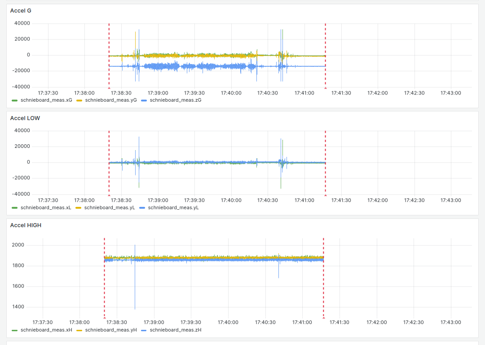
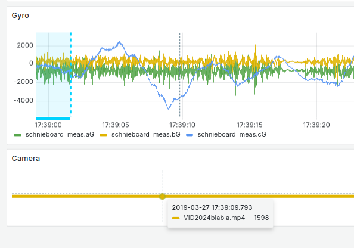
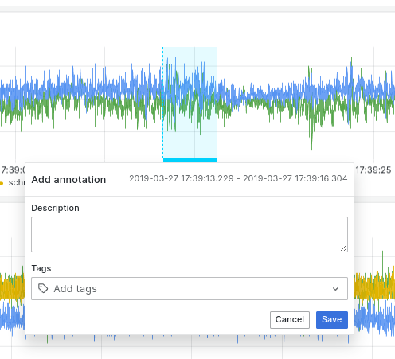
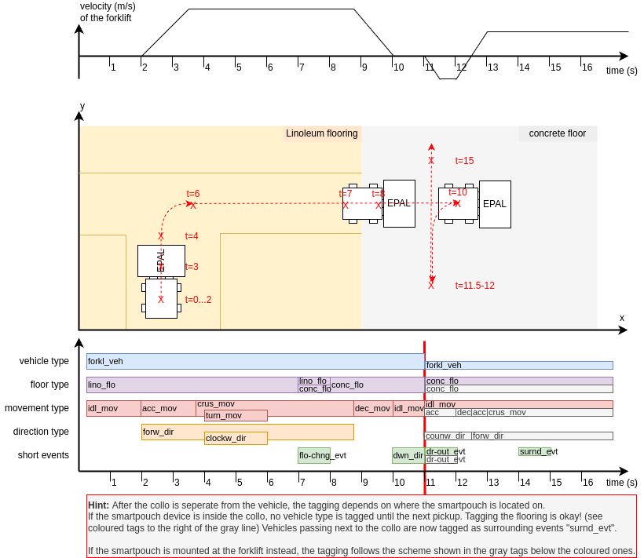

## recording data
see [existing pouch-sw repo](https://github.com/movement-recognition/pouch-sw) for base-files and the [pouch-ucboard](https://github.com/movement-recognition/pouch-ucboard) repository for a short architectural overview. The script used for uploading the raw data the _ucboard_ (also called _Schnieboard_ internally) writes to its SD-card is placed inside this repo.

Due to reliability issues, the process doesn't rely on this method anymore. instead it uses the raspberry-pi-SBC inside the normal pouch-casing. The _ucboard_ is therefor connected to the Pi via USB and appears as a serial device there.

The `process_orange.py`-Script ([see here](https://github.com/movement-recognition/pouch-sw/blob/main/process_orange.py)) was refactored. First of all it's now called `purple.py`. Instead of pushing only the tris- and anal-Datapoints to the local influx-Database of the raspberry pi it now dumps all the incoming datapoints (so primarily the meas-datapoints are of big interest) directly to the console. By piping this output to a file a log is created automatically:

`python3 purple.py > logfile.jsonl`

Make sure, the system-time of the device is in sync either to UTC or your other time bases used in your lab setup. The data outputted is not completely conform to the [JSON line format](https://jsonlines.org/) because of disturbing print-outputs of the program. For parsing, lines containing no valid json-objects can just be ignored for now.

## uploading data

### directly from schnieboard-SD-card

TBD (solution exists but is not documented yet)

### using `purple.py`

The `logupload.py` program should be used for ingesting the data to the influx database:

`python3 logupload.py upload-ljson --inputFile "test.json"`

After the upload is complete, data should now appear in the grafana-dashboard:



If you can't see anything, use the time selector at the top right corner to select the date range you need. It helps to start with a bigger range and then zoom in to the ROI you want to work.

The dashed red lines mark the start- and endpoints of the file you just uploaded. if you hover over them you can see the filename.

## preparing videos

how to embed frame numbers into existing videos:
```
ffmpeg -i VID_20240327_112204Z.mp4 -vf " drawtext=fontfile=/usr/share/fonts/TTF/Inconsolata-Medium.ttf: text='%{pts} |%{frame_num}/%{nb_frames}': start_number=1: x=(w-tw)/2: y=h-(2*lh): fontcolor=black: fontsize=20: box=1: boxcolor=white: boxborderw=5" -c:a copy output_video.mp4
```

If you have timestamps in your video, also upload those to the database by also using the `logupload.py`-file by using the `upload-videostamps` method:

`python3 logupload.py upload-videostamps --inputFile="VID20233foobar.mp4" --startMarkerTime 2019-03-27T17:38:40.00 --startmarkerframe=100 --endmarkerframe=13785 --framerate 15.03`

If the upload was successful, you can go back to the grafana window and scroll down to the "Camera"-Plot. There you'll see a bunch of dots (if you are on big zoom levels it looks more like a thicker line). If you hover over them, you can extract the framenumer in the tooltip as well as compare it to the recorded data in the diagrams above by using the synchronized crosshairs displayed in all diagrams.



## annotating data

To annotate the data, select the range you want to label by keeping the Ctrl-Key pressed while dragging the desired range with your mouse. When stopping this dragging motion, a popup-window appears as showed below. In there you can add a short description if you want, and most importantly add one or more tags from the list below.



| **Tag**    | **Full Name**        | **Comments** |
|------------|----------------------|-------------------------------------------------------------------------------------------------------------------------------------------------------------------------------------------------------------------------------------------------|
| **_veh_**  | **_vehicle type_**   | _the kind of vehicle that the sensor device is currently sitting on; *always* specify this, even when idling_ |
| man_veh    | manual               | everything that is direct human interaction without a tool or vehicle |
| pltk_veh   | pallet truck         |  |
| forkl_veh  | forkflift            |  |
| truck_veh  | truck                |  |
| **_flo_**  | **_floor type_**     | _the kind of floor the vehicle or device itself is currently moving/idling upon; *always* specify this, even when idling_ |
| lino_flo   | linoleum             |  |
| conc_flo   | concrete             |  |
| asph_flo   | asphalt              |  |
| grav_flo   | gravel               |  |
| carp_flo   | carpet               |  |
| tiles_flo  | tiles                |  |
| **_mov_**  | **_movement type_**  | _the movement speed and its development over time (exception: turn_mov is a flag)_ |
| acc_mov    | accelerating         | can be combined with direction |
| dec_mov    | decelerating         | can be combined with direction |
| idl_mov    | idle                 |  |
| crus_mov   | crusing              | generally for longer movements; in case of clear directions, should be combined with one or more directions; else (or when a combination of e.g. different small curves) can be left undefined |
| turn_mov   | turn (in direction)  | for intended turns of direction (e.g. 90° on "crossroads" between two warehouse routes; as opposed to slight unimportant direction changes to just avoid an obstacle while generally going e.g. straight forward); free flag to be added on top of an already complete movement description |
| **_dir_**  | **_direction type_** | _the direction parameter(s) to a movement_ |
| up_dir     | up                   | only to be used for forklifts; for pallet trucks, use lf-up_evt |
| dwn_dir    | down                 | only to be used for forklifts; for pallet trucks, use lf-dw_evt |
| clocw_dir  | clockwise            |  |
| counw_dir  | counter-clockwise    |  |
| forw_dir   | forwards             |  |
| bac_dir    | backwards            |  |
| **_evt_**  | **_short events_**   | _shortcuts for common events; replaces mov and dir types (and vice versa), except noted otherwise_ |
| dr-un_evt  | drive under          | pallet truck or forklift under a pallet |
| dr-out_evt | drive out            | pallet truck or forklift under a pallet |
| lf-up_evt  | lift up              |  |
| lf-dw_evt  | lift down            |  |
| tilt_evt   | tilt                 | can be combined with direction |
| crsh_evt   | crash                | any kind of accident |
| surnd_evt  | surrounding event    | any kind of (possibly) measurable distraction in the surroundings that is not directly attached or interacting with the device; free flag to be added on top of an already complete situation description (may often be idl_mov, and the respective vehicle and floor) |
| flo-chng_evt | floor change       | when driving from one kind of floor surface to the next; applicable only for the time range in which not all wheels/feet of the vehicle are on the same floor; shall be used as a flag on top of a mov-based description (similar to the usage of turn); both floors shall be tagged in this range |

It helps, if you are only using one diagram for annotating (e.g. the one for "gyro") to avoid overlapping tagging -- but for the further steps it doesn't matter, all ranges are thrown together into one big dataset.



There is a program checking all existing labels for correctness. Call `src/data_sanitizer.py sanitize-tags`. The program creates an `index.html` which you can view with a webbrowser. In the most right column, the sanitizer highlights possible errors. By clicking on the links, your browser directly zooms into the time range of the dataset. If the sanitizer made an false alarm, you can just add an additional `sane`-Tag to the annotation. The sanitizer script then ignores this entry.

## download/generate training datasets

The dataset labeled in the grafana+influxDB-Stack can be extracted by the following chain of micro-tools:
First of all you need to download the raw sensor data, filtered by a selection of tags you want:

`python3 dataprepper.py list-annotations --tagFilter="man_veh,lf-dw_evt;man_veh,lf-up_evt"`

If you concatenate two or more tags with a comma (`man_veh,lf-dw_evt`), they are AND-linked together. You can join multiple of those queries by splitting those filters with a semicolon. If doing that, please use `"`-marks to escape the semicolon from your command line.

In the list below you'll get a preview of what tagged regions you'll get in your export.

```
     StartTime          EndTime           Description                                Tags
[o]  24-04-12T12:59:08  24-04-12T12:59:16 idling (after stopping, before acc again)  pltk lino  idl/----- ----- 
[o]  24-04-12T12:59:16  24-04-12T12:59:21 acc again                                  pltk lino  acc/forw  ----- 
[o]  24-04-12T12:59:21  24-04-12T12:59:24 crusing forwards                           pltk lino crus/forw  ----- 
[o]  24-04-12T12:59:24  24-04-12T12:59:29 turning "right"                            pltk lino crus/clocw ----- 
[o]  24-04-12T12:59:29  24-04-12T12:59:33 slowing down                               pltk lino  dec/forw  ----- 
[o]  24-04-12T12:59:33  24-04-12T12:59:37 soft lift down                             pltk lino ----/----- lf-dw
```

If you think, this selection fits your needs, you then can use your filter-query with the following command:

`python3 dataprepper.py load-data-to-csv --tagFilter="man_veh,lf-dw_evt;man_veh,lf-up_evt" --outputFile="data_idle.csv"`

This results in a kind of raw-file-format containing all raw data captured by the sensors -- but filtered by the filter.
```
,time,aG,bG,cG,xG,yG,zG,xH,yH,zH,xL,yL,zL
0,2019-03-27T11:36:11.622Z,-705,279,-161,-340,-1324,-14072,1879,1878,1859,-234,0,-9438
1,2019-03-27T16:40:09.37Z,-288,603,737,-272,-1856,-16656,1883,1877,1865,-702,-234,-11154
2,2019-03-27T16:40:09.375Z,-783,562,779,332,-2028,-16356,1874,1881,1865,0,-312,-11154
3,2019-03-27T16:40:09.38Z,-1275,153,872,736,-1120,-14868,1889,1877,1851,78,390,-9984
```

With a third processing method you can then convert this intermediate file into a format which is similar to the columns/statistical features used in the [HAR-Dataset](https://doi.org/10.24432/C54S4K)/[or here](https://www.semanticscholar.org/paper/A-Public-Domain-Dataset-for-Human-Activity-using-Anguita-Ghio/83de43bc849ad3d9579ccf540e6fe566ef90a58e):

`python3 dataprepper.py raw-csv-to-har-format --inputFile=data_idle.csv --outputFile=data_idle.har.csv`

If you want, you can use the following parameters to apply some basic kinds of augmentation. By default, the data is overlapped by 50% to double the amount of outputted data.
```
--chunkSize INTEGER       Chunk size used for grouping and statistical analysis. defaults to 500ms.
--chunkOverlap FLOAT      Overlap between two chunks/windows used for statistical 
--usedDataTracks          Which data/sensor tracks to use. e.g. "xyzH,xyzL,xyzG,abcG"
--usedStatFilters         List all statistical features that should be exported to the har file. possible options are: mean,std,mad,min,max,sma,iqr,entropy,energy,energy_band.
                          Caution: "entropy" can return infinite values (positive and negative), use with care.
```

You can get also get help or short explanation-texts for the parameters by calling all of the listed commands above with the `--help`-suffix.
Depending on the configuration, the script may take several minutes or reserve multiple gigabytes of RAM. Please consider deactivating oversampling and/or reducing the number of statistical filters/features. See the following [document](doc/performance.md) for performance measurements.

By using the **export.sh**-script, multiple _per-category_ `.har.csv`-files can be generated. Additionally, the script concatenates multiple of those and also creates a seperate file with labels


### Proposal of tag-groupings

- movement of any kind: `--tagFilter="dec_mov;acc_mov;crus_mov;turn_mov" --mergeThreshold=100` (works as long as no non-`pltk_veh`-Datasets are uploaded)
- idling around: `--tagFilter="idl_mov" --mergeThreshold=100`
- picking up: `--tagFilter="dr-un_evt;lf-up_evt" --mergeThreshold=100`
- letting down: `--tagFilter="dr-out_evt;lf-dw_evt" --mergeThreshold=100`
