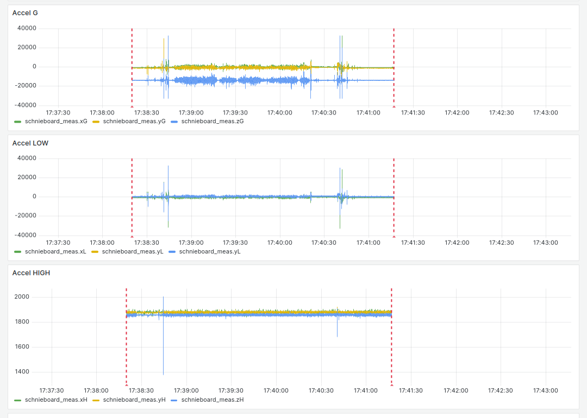
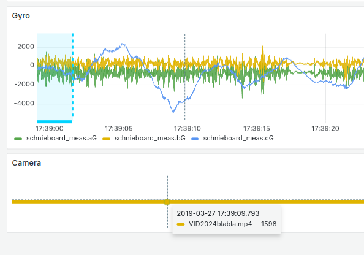
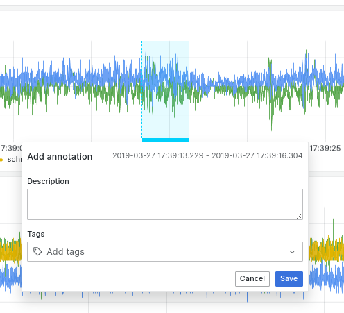

## recording data
see [existing pouch-sw repo](https://github.com/movement-recognition/pouch-sw) for base-files and the [pouch-ucboard](https://github.com/movement-recognition/pouch-ucboard) repository for a short architectural overview. The script used for uploading the raw data the _ucboard_ (also called _Schnieboard_ internally) writes to its SD-card is placed inside this repo.

Due to reliability issues, the process doesn't rely on this method anymore. instead it uses the raspberry-pi-SBC inside the normal pouch-casing. The _ucboard_ is therefor connected to the Pi via USB and appears as a serial device there.

The `process_orange.py`-Script ([see here](https://github.com/movement-recognition/pouch-sw/blob/main/process_orange.py)) was refactored. First of all it's now called `purple.py`. Instead of pushing only the tris- and anal-Datapoints to the local influx-Database of the raspberry pi it now dumps all the incoming datapoints (so primarily the meas-datapoints are of big interest) directly to the console. By piping this output to a file a log is created automatically:

`python3 purple.py > logfile.jsonl`

Make sure, the system-time of the device is in sync either to UTC or your other time bases used in your lab setup. The data outputted is not completely conform to the [JSON line format](https://jsonlines.org/) because of disturbing print-outputs of the program. For parsing, lines containing no valid json-objects can just be ignored for now.

## uploading data

### directly from schnieboard-SD-card

### using `purple.py`

The `logupload.py` program should be used for ingesting the data to the influx database:

`python3 logupload.py upload-ljson --inputFile "test.json"`

After the upload is complete, data should now appear in the grafana-dashboard:


If you can't see anything, use the time selector at the top right corner to select the date range you need. It helps to start with a bigger range and then zoom in to the ROI you want to work.

The dashed red lines mark the start- and endpoints of the file you just uploaded. if you hover over them you can see the filename.

## preparing videos

how to embed frame numbers into existing videos:
```
ffmpeg -i VID_20240327_112204Z.mp4 -vf " drawtext=fontfile=/usr/share/fonts/TTF/Inconsolata-Medium.ttf: text='%{pts} |%{frame_num}/%{nb_frames}': start_number=1: x=(w-tw)/2: y=h-(2*lh): fontcolor=black: fontsize=20: box=1: boxcolor=white: boxborderw=5" -c:a copy output_video.mp4
```

If you have timestamps in your video, also upload those to the database by also using the `logupload.py`-file by using the `upload-videostamps` method:

`python3 logupload.py upload-videostamps --inputFile="VID20233foobar.mp4" --startMarkerTime 2019-03-27T17:38:40.00 --startmarkerframe=100 --endmarkerframe=13785 --framerate 15.03`

If the upload was successful, you can go back to the grafana window and scroll down to the "Camera"-Plot. There you'll see a bunch of dots (if you are on big zoom levels it looks more like a thicker line). If you hover over them, you can extract the framenumer in the tooltip as well as compare it to the recorded data in the diagrams above by using the synchronized crosshairs displayed in all diagrams.


## annotating data

To annotate the data, select the range you want to label by keeping the Ctrl-Key pressed while dragging the desired range with your mouse. When stopping this dragging motion, a popup-window appears as showed below. In there you can add a short description if you want, and most importantly add one or more tags from the list below.



| **Tag**    | **Full Name**        | **Comments**                                                                                                                                                                                                                                    |
|------------|----------------------|-------------------------------------------------------------------------------------------------------------------------------------------------------------------------------------------------------------------------------------------------|
| **_veh_**  | **_vehicle type_**   |                                                                                                                                                                                                                                                 |
| man_veh    | manual               | everything that is direct human interaction without a tool or vehicle                                                                                                                                                                           |
| pltk_veh   | pallet truck         |                                                                                                                                                                                                                                                 |
| forkl_veh  | forkflift            |                                                                                                                                                                                                                                                 |
| truck_veh  | truck                |                                                                                                                                                                                                                                                 |
| **_flo_**  | **_floor type_**     |                                                                                                                                                                                                                                                 |
| lino_flo   | linoleum             |                                                                                                                                                                                                                                                 |
| conc_flo   | concrete             |                                                                                                                                                                                                                                                 |
| asph_flo   | asphalt              |                                                                                                                                                                                                                                                 |
| grav_flo   | gravel               |                                                                                                                                                                                                                                                 |
| carp_flo   | carpet               |                                                                                                                                                                                                                                                 |
| **_mov_**  | **_movement type_**  |                                                                                                                                                                                                                                                 |
| acc_mov    | accelerating         | can be combined with direction                                                                                                                                                                                                                  |
| dec_mov    | decelerating         | can be combined with direction                                                                                                                                                                                                                  |
| idl_mov    | idle                 |                                                                                                                                                                                                                                                 |
| crus_mov   | crusing              | generally for longer movements; in case of clear directions, should be combined with one or more directions; else (or when a combination of e.g. different small curves) can be left undefined                                                  |
| turn_mov   | turn (in direction)  | for short, intended, clearly delimitable turns of direction (e.g. 90° on "crossroads" between two warehouse routes; as opposed to slight unimportant direction changes while generally going straight forward). MUST be combined with direction |
| **_dir_**  | **_direction type_** |                                                                                                                                                                                                                                                 |
| up_dir     | up                   |                                                                                                                                                                                                                                                 |
| dwn_dir    | down                 |                                                                                                                                                                                                                                                 |
| ri_dir     | right                |                                                                                                                                                                                                                                                 |
| le_dir     | left                 |                                                                                                                                                                                                                                                 |
| forw_dir   | forwards             |                                                                                                                                                                                                                                                 |
| bac_dir    | backwards            |                                                                                                                                                                                                                                                 |
| **_evt_**  | **_short events_**   |                                                                                                                                                                                                                                                 |
| dr-un_evt  | drive under          | pallet truck or forklift under a pallet                                                                                                                                                                                                         |
| dr-out_evt | drive out            | pallet truck or forklift under a pallet                                                                                                                                                                                                         |
| lf-up_evt  | lift up              |                                                                                                                                                                                                                                                 |
| lf-dw_evt  | lift down            |                                                                                                                                                                                                                                                 |
| tilt_evt   | tilt                 | can be combined with direction                                                                                                                                                                                                                  |
| crsh_evt   | crash                | any kind of accident                                                                                                                                                                                                                            |
| surnd_evt  | surrounding event    | any kind of (possibly) measurable distraction in the surroundings that is not directly attached or interacting with the device                                                                                                                  |

It helps, if you are only using one diagram for annotating (e.g. the one for "gyro") to avoid overlapping tagging -- but for the further steps it doesn't matter, all ranges are thrown together into one big dataset.


## download/generate training datasets

The dataset labeled in the grafana+influxDB-Stack can be extracted by the following chain of micro-tools:
First of all you need to download the raw sensor data, filtered by a selection of tags you want:

`python3 dataprepper.py list-annotations --tagFilter="man_veh,lf-dw_evt;man_veh,lf-up_evt"`

If you concatenate two or more tags with a comma (`man_veh,lf-dw_evt`), they are AND-linked together. You can join multiple of those queries by splitting those filters with a semicolon. If doing that, please use `"`-marks to escape the semicolon from your command line.

In the list below you'll get a preview of what tagged regions you'll get in your export.

```
     StartTime          EndTime           Description          Tags
[x]  24-04-12T12:58:06  24-04-12T12:58:07 Stellplatz Stuhl     ['lf-dw_evt', 'man_veh']
[ ]  24-04-12T12:57:27  24-04-12T12:57:47 Kurvige Fahrt        ['crus_mov', 'forw_dir', 'man_veh']
[ ]  24-04-12T12:57:21  24-04-12T12:57:23 Beschleunigen 1      ['acc_mov', 'back_dir', 'man_veh']
[x]  24-04-12T12:57:12  24-04-12T12:57:21 Hubwagen anheben     ['lf-up_evt', 'man_veh']
[ ]  24-04-12T12:57:08  24-04-12T12:57:12 Hubwagen unterfahren ['dr-un_evt', 'man_veh']
```

If you think, this selection fits your needs, you then can use your filter-query with the following command:

`python3 dataprepper.py load-data-to-csv --tagFilter="man_veh,lf-dw_evt;man_veh,lf-up_evt" --outputFile="data_idle.csv"`

This results in a kind of raw-file-format containing all raw data captured by the sensors -- but filtered by the filter.
```
,time,aG,bG,cG,xG,yG,zG,xH,yH,zH,xL,yL,zL
0,2019-03-27T11:36:11.622Z,-705,279,-161,-340,-1324,-14072,1879,1878,1859,-234,0,-9438
1,2019-03-27T16:40:09.37Z,-288,603,737,-272,-1856,-16656,1883,1877,1865,-702,-234,-11154
2,2019-03-27T16:40:09.375Z,-783,562,779,332,-2028,-16356,1874,1881,1865,0,-312,-11154
3,2019-03-27T16:40:09.38Z,-1275,153,872,736,-1120,-14868,1889,1877,1851,78,390,-9984
```

With a third processing method you can then convert this intermediate file into a format which is similar to the columns/statistical features used in the [HAR-Dataset](https://doi.org/10.24432/C54S4K)/[or here](https://www.semanticscholar.org/paper/A-Public-Domain-Dataset-for-Human-Activity-using-Anguita-Ghio/83de43bc849ad3d9579ccf540e6fe566ef90a58e):

`python3 dataprepper.py raw-csv-to-har-format --inputFile=data_idle.csv --outputFile=idle_data_har.csv`

If you want, you can use the following parameters to apply some basic kinds of augmentation. By default, the data is overlapped by 50% to double the amount of outputted data.
```
--chunkSize INTEGER       Chunk size used for grouping and statistical analysis. defaults to 500ms.
--chunkOverlap FLOAT      Overlap between two chunks/windows used for statistical analysis
```

Not implemented yet but may be in future: Option to enable/disable data-streams in har-generation (e.g. do not export gyro-data/ignore the Low-G-Sensor et cetera)

You can get also get help or short explanation-texts for the parameters by calling all of the listed commands above with the `--help`-suffix.

#### WARNING: At the moment, the labels are not exported to the files in any kind. you have to do this by yourself, e.g. by using a basic shell script fetching the data for each category and adding it's label as a seperate column. 
